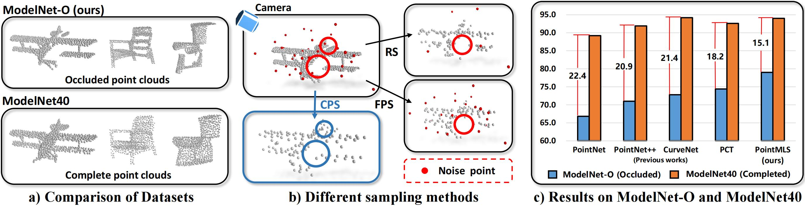
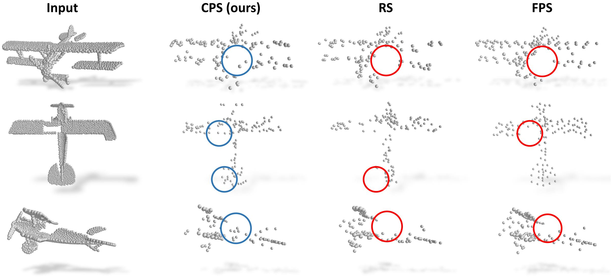

<p align="center">
  <h1 align="center">ModelNet-O: A Large-Scale Synthetic Dataset for 

Occlusion-Aware Point Cloud Classification</h1>
  <p align="center">
    arXiv, 2024
    <br />
    <a href="https://github.com/fanglaosi/"><strong>Zhongbin Fang</strong></a>
    ·
    <a href="https://xialipku.github.io/"><strong>Xia Li</strong></a>
    .
    <a href="https://lxtgh.github.io/"><strong>Xiangtai Li</strong></a>
    .
    <a href="https://scholar.google.com/citations?hl=zh-CN&user=U68XZOgAAAAJ"><strong>Shen Zhao📧</strong></a>
    .
    <a href="https://www.ece.pku.edu.cn/info/1046/2596.htm"><strong>Mengyuan Liu📧</strong></a>
  </p>

  <p align="center">
    <a href='https://arxiv.org/pdf/2401.08210.pdf'>
      
    </a>
    <a href='https://github.com/fanglaosi/PointMLS' style='padding-left: 0.5rem;'>
      
    </a>
  </p>

<div  align="center">    
 
</div>

# 🙂News

[//]: # (- [2024.5.20] Our [PointMLS]&#40;https://arxiv.org/abs/2401.08210&#41; is accepted at [Computer Vision and Image Understanding &#40;CVIU&#41;]&#40;https://www.sciencedirect.com/journal/computer-vision-and-image-understanding&#41;! 🎉🎉🎉)
- [2023.5.13] [ModelNet-O](https://drive.google.com/file/d/1JLVok7BgmtS0TKLc7lwBwWy2VMND_SEW/view?usp=sharing) and training code are open-sourced.
- [2024.1.16] Our [PointMLS](https://arxiv.org/abs/2401.08210) is released and GitHub repo is created.


## ⚡Hightlights

- We introduce a challenging occlusion point cloud classification dataset ModelNet-O that better reflects real-world scenarios and contains large-scale data.
- We propose a robust point cloud classification method, PointMLS, based on a multi-level sampling strategy.
- PointMLS achieves state-of-the-art overall accuracy on the occlusion point cloud dataset ModelNet-O and achieves competitive accuracy on the regular datasets, ModelNet40 and ScanObjectNN.

# ✋Install

### Install running environment for PointMLS

```bash
conda create -n pointmls python=3.9 -y # create environment for PointMLS
conda activate pointmls
conda install pytorch==1.12.1 torchvision==0.13.1 torchaudio==0.12.1 cudatoolkit=11.3 -c pytorch # follow the Cuda version of your machine
pip install -r requirements.txt # install dependencies
pip install ninja # for c++ extensions (chamfer distance)
```

```bash
# install Pytorch3d for fps and knn
git clone https://github.com/facebookresearch/pytorch3d.git
cd pytorch3d
export CUB_HOME=/usr/local/cuda/include/
FORCE_CUDA=1 python setup.py install
```

# 😛[ModelNet-O](https://drive.google.com/file/d/1JLVok7BgmtS0TKLc7lwBwWy2VMND_SEW/view?usp=sharing): a large-scale occluded point cloud dataset

## Download/Generate Dataset

You can preprocess the dataset yourself, see the [ModelNet/data_generate/README.md](ModelNet/data_generate/README.md).
> ❗ Note that it will take a long time (about 7-10 days).

Thus, we have provided the [pre-processed_datasets](https://drive.google.com/file/d/1JLVok7BgmtS0TKLc7lwBwWy2VMND_SEW/view?usp=sharing) **(recommend)**. Please download it and unzip it in ```data/```

## Training and testing on ModelNet-O
```bash
sh train_occluded.sh # training PointMLS in a multi-level manner
sh test_occluded.sh # testing PointMLS in a multi-level manner
```

## Visualization

Our proposed critical point sampling method can preserve structural information of the point clouds with self-occlusion.

<div  align="center">    
 
</div>


# 🧐ModelNet40 and ScanObjectNN

## Usage
Training and testing on ModelNet40
```bash
python main.py --model PointMLS_basic --checkpoint "checkpoint/ModelNet40" --dataset "MN40" # training
python test.py --model PointMLS_basic --checkpoint "checkpoint/ModelNet40" --dataset "MN40" # testing
python voting.py --model PointMLS_basic
```

Training and testing on ScanObjectNN
```bash
python main.py --model PointMLS_basic # training
python test.py --model PointMLS_basic # testing
```


# Acknowledgment
Our work is bulit upon previous works, thanks to the following excellent works: [PointNet](https://github.com/fxia22/pointnet.pytorch), [PointMLP](https://github.com/ma-xu/pointMLP-pytorch), [PointView-GCN](https://github.com/SMohammadi89/PointView-GCN/tree/master), [ModelNet40](https://3dshapenets.cs.princeton.edu/), [ScanObjectNN](https://hkust-vgd.github.io/scanobjectnn/)


# LICENSE
Apache-2.0 license. 

# BibTeX

```
@article{fang2024modelnet,
  title={ModelNet-O: A Large-Scale Synthetic Dataset for Occlusion-Aware Point Cloud Classification},
  author={Fang, Zhongbin and Li, Xia and Li, Xiangtai and Zhao, Shen and Liu, Mengyuan},
  journal={arXiv preprint arXiv:2401.08210},
  year={2024}
}
```


